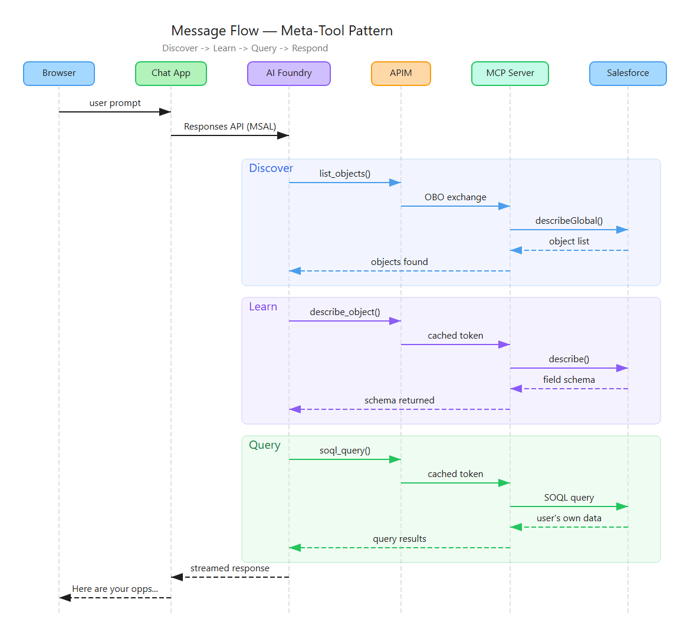
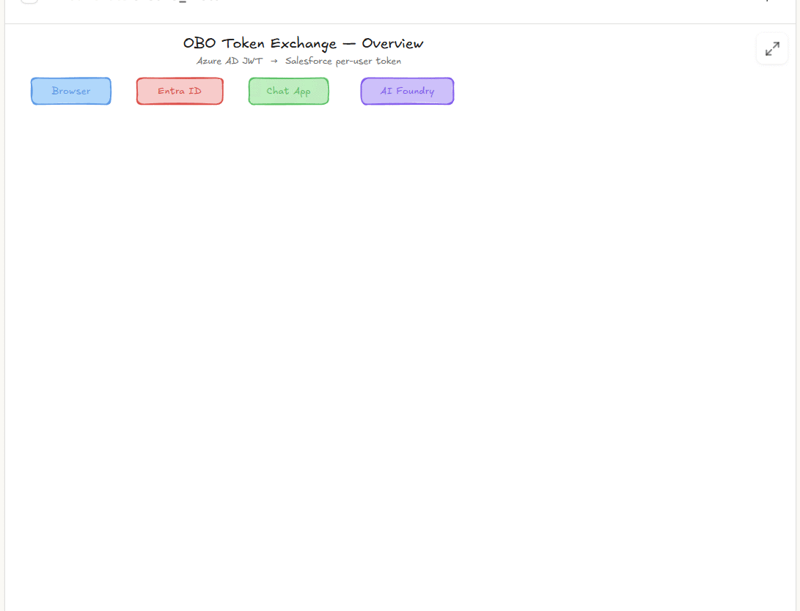
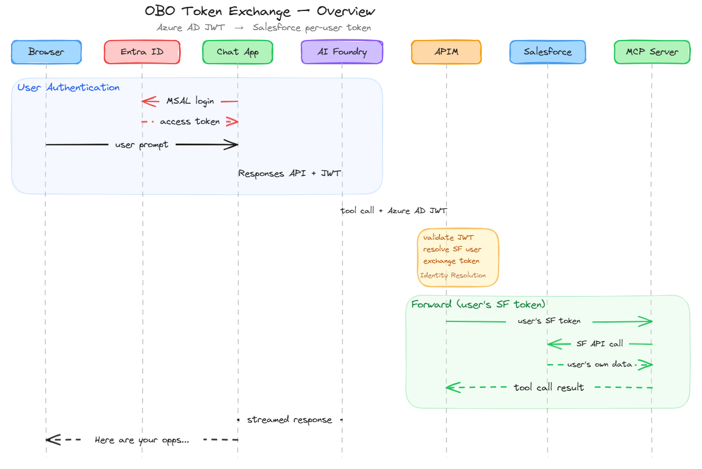

# Salesforce Meta-Tool: Identity Propagation

[](LICENSE)
[](https://learn.microsoft.com/azure/developer/azure-developer-cli/)
[](https://www.python.org/)

**One sign-on. Six tools. Your entire Salesforce org, with the user's own identity enforced end-to-end.**

## The Problem

### 1. Full CRM Access Without Tool-Per-Object

An agent should be able to do everything the user can do in Salesforce (query any object, update any record, run any approval workflow) without the server having to define a tool for each one. Most MCP servers take the opposite approach: one tool per object, which means every new custom object requires a code change, the tool list grows linearly, and the security model has to be reimplemented from scratch. The goal is to give the agent the user's full CRM surface while inheriting the permissions and security that Salesforce already enforces.

### 2. The User's Own Permissions, Not a Service Account's

If the agent can do everything in Salesforce, it must operate under the user's own identity, with their sharing rules, field-level security, and approval workflows, not a service account that sees all data. Most integrations solve this by reinventing a permissions layer in the middleware. The simpler answer is to propagate the user's identity end-to-end and let Salesforce enforce the rules it already has, even when that identity crosses boundaries from Azure AD to Salesforce, possibly through federated IdPs.

## This Project

A metadata-driven MCP server that solves both problems: six tools that let an AI agent discover objects, learn field schemas, and construct SOQL queries at runtime (the meta-tool pattern), with true On-Behalf-Of identity propagation that enforces the user's own permissions end-to-end. The user authenticates once to Azure AD; the system handles the rest.

```
azd up   # deploys the full stack in ~15 minutes
```

---

## How It Works

The user asks a question. The agent discovers objects, learns schemas, and queries Salesforce — all through the same six tools, all with the user's own identity.

<table><tr>
<td></td>
<td></td>
</tr></table>

> [Excalidraw source](docs/diagrams/message-flow-sequence.excalidraw)

### On-Behalf-Of (OBO) Token Exchange

APIM handles a three-phase exchange: validate the Azure AD JWT, resolve the Salesforce username, and acquire a per-user Salesforce token. The MCP server never sees Azure AD credentials.

<table><tr>
<td></td>
<td></td>
</tr></table>

> **Deep dive:** [Detailed OBO exchange animation](docs/diagrams/obo-token-exchange.gif) | [Full detail PNG](docs/diagrams/obo-token-exchange.png) | [Excalidraw source](docs/diagrams/obo-token-exchange.excalidraw)

## The 6 Tools: 1,235 Tokens for All of Salesforce

| Tool | Tokens | What it does |
|------|--------|--------------|
| `list_objects` | 117 | Discover objects (1000+ in a typical org), filter by name/label |
| `describe_object` | 109 | Field schemas, types, required flags, picklists, external IDs |
| `soql_query` | 225 | Full SOQL: relationships, aggregates, GROUP BY, auto-pagination |
| `search_records` | 175 | SOSL full-text search across multiple objects simultaneously |
| `write_record` | 226 | Create, update, upsert (by external ID), delete |
| `process_approval` | 129 | Submit, approve, reject via Salesforce approval workflows |
| **Server instructions** | **254** | Workflow guidance, conventions, when-to-use-which-tool |
| **Total** | **1,235** | **All objects, all fields, all operations** |

> **Note:** The 1,235 tokens cover tool definitions. Each `describe_object` call returns field schemas at runtime. Schemas are loaded on demand rather than pre-loaded into the system prompt.

---

## Deep Dive

For detailed technical explanations, see [docs/deepdive.md](docs/deepdive.md):

- [**The Meta-Tool Pattern**](docs/deepdive.md#the-meta-tool-pattern) — Why six tools beat one-per-object, with token cost comparison
- [**Tool Reference**](docs/deepdive.md#tool-reference) — Per-tool descriptions with Unix analogies
- [**Identity Propagation: End-to-End**](docs/deepdive.md#identity-propagation-end-to-end) — Architecture, hop-by-hop token trace, caching layers, key guarantees
- [**IdP Flexibility**](docs/deepdive.md#idp-flexibility) — How to swap Azure AD for Okta, PingFed, or another OIDC provider
- [**Current Scope and Limitations**](docs/deepdive.md#current-scope-and-limitations) — Production considerations
- [**Diagram Sources**](docs/deepdive.md#diagram-sources) — Mermaid sources for both sequence diagrams

---

## Deployment and Setup

> **New to this project?** Follow the [step-by-step installation guide](docs/installation.md)
> for a complete walkthrough from a clean Azure subscription and Salesforce org.

### Prerequisites

| Requirement | Version | Link |
|-------------|---------|------|
| Azure subscription | Contributor + User Access Admin | [Free trial](https://azure.microsoft.com/free/) |
| Azure Developer CLI | 1.5+ | [Install azd](https://learn.microsoft.com/azure/developer/azure-developer-cli/install-azd) |
| Azure CLI | 2.60+ | [Install az](https://learn.microsoft.com/cli/azure/install-azure-cli) |
| Python | 3.11+ | [python.org](https://www.python.org/) |
| Docker Desktop | - | [docker.com](https://www.docker.com/products/docker-desktop/) |
| Salesforce CLI | sf 2.x | [Install sf](https://developer.salesforce.com/tools/salesforcecli) |
| OpenSSL | - | Pre-installed on macOS/Linux; [Git for Windows](https://gitforwindows.org/) includes it |
| Salesforce org | Developer or Sandbox | [developer.salesforce.com](https://developer.salesforce.com/signup) |

### Quick Deploy

If you already have a configured Salesforce org and certificate:

```bash
git clone https://github.com/ozgurkarahan/salesforce-meta-tool-identity-propagation.git
cd salesforce-meta-tool-identity-propagation
pip install -r requirements.txt

azd env new obo
azd env set SF_INSTANCE_URL "https://your-org.my.salesforce.com"
azd env set SF_CONNECTED_APP_CLIENT_ID "<connected-app-consumer-key>"
azd env set SF_SERVICE_ACCOUNT_USERNAME "<svc@your-org.my.salesforce.com>"

azd up
```

The postprovision hook automatically uploads `certs/sf-jwt-bearer.pfx` to Key Vault, creates the APIM certificate binding, and sets `SF_JWT_BEARER_CERT_THUMBPRINT`. No manual thumbprint step needed.

After `azd up` completes, open the Chat App URL printed at the end. Sign in with your Azure AD account and send a message (e.g., *"Show me my Salesforce accounts"*).

### From Scratch

1. **Generate certificate** — see [installation guide Phase 1](docs/installation.md#phase-1-generate-x509-certificate)
2. **Salesforce setup** — see [installation guide Phase 2](docs/installation.md#phase-2-salesforce-org-setup)
3. **Set environment variables** (3 vars — no thumbprint needed):
   ```bash
   azd env set SF_INSTANCE_URL "https://your-org.my.salesforce.com"
   azd env set SF_CONNECTED_APP_CLIENT_ID "<consumer-key>"
   azd env set SF_SERVICE_ACCOUNT_USERNAME "<svc@your-org.my.salesforce.com>"
   ```
4. **Deploy:** `azd up`
5. **Map user identities** — see [installation guide Phase 4](docs/installation.md#phase-4-map-user-identities)

### Environment Variables

| Variable | Required | Description |
|----------|----------|-------------|
| `SF_INSTANCE_URL` | Yes | Salesforce org URL (e.g., `https://myorg.my.salesforce.com`) |
| `SF_CONNECTED_APP_CLIENT_ID` | Yes | Consumer Key from the Salesforce Connected App |
| `SF_SERVICE_ACCOUNT_USERNAME` | Yes | SF service account username for SOQL user lookups |
| `SF_JWT_BEARER_CERT_THUMBPRINT` | Auto | Auto-set by postprovision hook; only set manually if skipping cert upload |
| `SF_JWT_BEARER_CERT_NAME` | No | Key Vault certificate name (default: `sf-jwt-bearer`) |
| `IDENTITY_CLAIM_NAME` | No | Azure AD JWT claim for user identity (default: `oid`) |
| `COGNITIVE_ACCOUNT_SUFFIX` | No | Increment after `azd down --purge` to avoid naming conflicts |
| `AZURE_LOCATION` | No | Azure region (default: `swedencentral`) |

### Project Structure

```
salesforce-meta-tool-identity-propagation/
+-- azure.yaml                    # azd project: 2 services (chat-app, salesforce-mcp)
+-- src/
|   +-- salesforce-mcp/
|   |   +-- app.py                # The MCP server: 6 tools, bearer passthrough
|   |   +-- salesforce_client.py  # Async Salesforce REST client with auth
|   +-- chat-app/
|       +-- app.py                # FastAPI backend, MSAL to Foundry agent bridge
|       +-- static/               # Vanilla JS SPA with MSAL.js
+-- infra/
|   +-- main.bicep                # Orchestrator, all Azure resources
|   +-- modules/                  # APIM, Key Vault, Container Apps, AI Services, ...
|   +-- policies/
|       +-- sf-mcp-obo-policy.xml     # OBO three-phase exchange policy
|       +-- sf-mcp-obo-prm-policy.xml # RFC 9728 PRM for OBO endpoint
+-- hooks/
|   +-- postprovision.py          # Cert upload + Entra app + Foundry agent + OBO connection
+-- scripts/
|   +-- sf_utils.py               # Shared SF/CLI primitives
|   +-- setup-sf-org.py           # Complete 5-step SF org setup orchestrator
|   +-- test-salesforce-mcp.py    # E2E MCP server test
+-- docs/                         # Architecture diagrams (Excalidraw)
```

### Common Issues

| Problem | Solution |
|---------|----------|
| "Project not found" after `azd down` | Increment `COGNITIVE_ACCOUNT_SUFFIX` and redeploy |
| APIM breaks MCP streaming | Set response body bytes to `0` in APIM diagnostics (All APIs scope) |
| Agent responds without calling tools | Check Foundry connection target URL |
| 401 "Invalid Azure AD token" | Check `validate-jwt` issuers include both v1 and v2 |
| 502 "SF Service Token Failed" | Bad certificate, wrong client ID, or service account not pre-authorized |
| 403 "User Not Mapped" | No SF user with matching `FederationIdentifier`. Run `setup-sf-org.py --only fedid` |
| 502 "SF Token Exchange Failed" | Target SF user not pre-authorized for the Connected App |

---

## Contributing

Contributions are welcome. Please open an [issue](https://github.com/ozgurkarahan/salesforce-meta-tool-identity-propagation/issues) or submit a pull request.

This project uses `azd` for deployment. See [Deployment and Setup](#deployment-and-setup) to get a local environment running.

---

## License

[MIT License](LICENSE)

---

*Related article: [The Meta-Tool Pattern Applied to Enterprise](https://www.linkedin.com/pulse/billion-dollar-agent-loop-ozgur-karahan-fszae/) on LinkedIn.*
