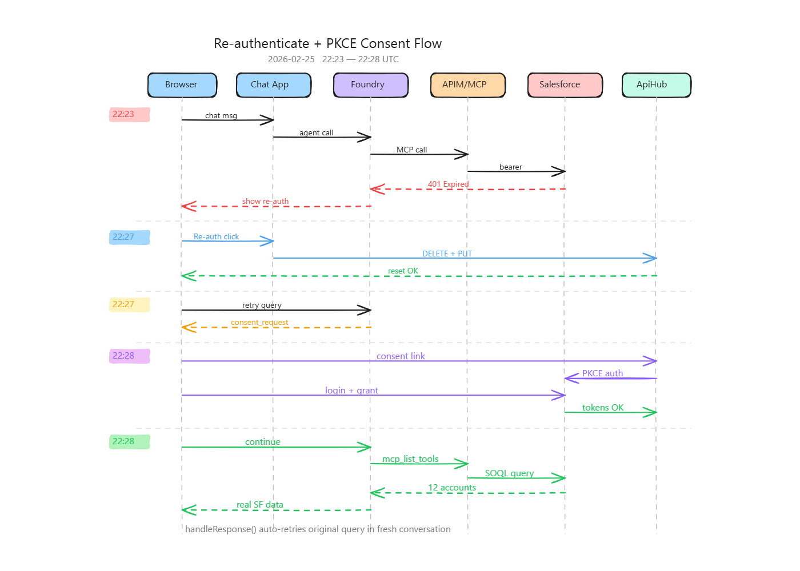

# Re-authenticate + PKCE Consent Flow

Detailed chronological trace of the full re-authenticate and native ApiHub PKCE consent flow, captured on **2026-02-25 22:23–22:28 UTC** against the `rg-sf-mcp-tool` deployment.

---

## Components

| Component | Resource | Role |
|---|---|---|
| **Browser** | Vanilla JS SPA + MSAL.js | User interface, MSAL auth, consent link navigation |
| **Chat App** | `ca-chat-app` (Container App, FastAPI) | Backend API, Foundry SDK calls, connection reset |
| **AI Foundry** | `salesforce-assistant` agent (gpt-4o) | Orchestrates MCP tool calls via Responses API |
| **APIM** | `apim-sf-mcp-tool` (API Management) | JWT validation (`validate-jwt`), reverse proxy |
| **MCP Server** | `ca-sf-mcp` (Container App, FastMCP) | Salesforce MCP tools (6 tools), bearer passthrough |
| **Salesforce** | Production org | OAuth provider, REST API, data source |
| **ApiHub/ARM** | Azure API Hub + ARM REST | OAuth connection management, per-user token store |
| **Entra ID** | Microsoft identity platform | MSAL authentication for Chat App users |

---

## Phase 1 — Token Expired (22:23)

The user sends a chat message. The Salesforce access token (seeded earlier by `grant-sf-mcp-consent.py`) has expired after 2 hours. APIM `validate-jwt` rejects the request.

| # | Time (UTC) | From | To | Event | Details |
|---|---|---|---|---|---|
| 1 | 22:23:48 | Browser | Chat App | `POST /api/chat` | Message: "give me salesforce accounts" |
| 2 | 22:23:48 | Chat App | AI Foundry | `responses.create()` | Agent invoked with MCP tools configured |
| 3 | 22:23:48 | AI Foundry | APIM | MCP tool call | `mcp_call` with bearer token from ApiHub |
| 4 | 22:23:48 | APIM | — | `validate-jwt` | **FAIL: TokenExpired** — SF access token TTL is 2h |
| 5 | 22:23:48 | APIM | AI Foundry | `401 Unauthorized` | JWT validation failed, request rejected |
| 6 | 22:23:48 | AI Foundry | Chat App | `tool_user_error` | Error contains "authentication...401" |
| 7 | 22:23:48 | Chat App | Browser | Re-auth banner | `isAuthError()` detects 401 + authentication keyword |
| 8 | 22:23:48 | Entra ID | — | Sign-in log | Status: 0 (success) — MSAL token is valid, only SF token expired |

**Result:** Browser shows "Re-authenticate" banner. User's MSAL session is fine — only the Salesforce token expired.

---

## Phase 2 — Re-authenticate (22:27)

User clicks "Re-authenticate". The Chat App backend DELETEs the existing ARM connection (clearing the expired refresh token) and PUTs a fresh one without credentials. This triggers ApiHub connector registration.

| # | Time (UTC) | From | To | Event | Details |
|---|---|---|---|---|---|
| 9 | 22:27:43 | Browser | Chat App | `POST /api/reset-mcp-auth` | User clicked "Re-authenticate" button |
| 10 | 22:27:43 | Chat App | ARM | `DELETE` connection | Remove `salesforce-oauth` connection (clears expired tokens) |
| 11 | 22:27:43 | Chat App | ARM | `PUT` connection | Recreate connection without credentials (authType: OAuth2) |
| 12 | 22:27:43 | ARM | ApiHub | Connector registered | ApiHub picks up the new connection, sets up managed API |
| 13 | 22:27:43 | Chat App | Browser | "Connections reset" | `resetAndRetry()` shows status message |

**Result:** Connection reset. No per-user tokens exist in ApiHub — next agent call will trigger consent.

---

## Phase 3 — Consent Request (22:27)

`resetAndRetry()` automatically retries the original query. Foundry agent tries to use MCP tools but ApiHub has no tokens for this user. Foundry returns `oauth_consent_request` with a consent link.

| # | Time (UTC) | From | To | Event | Details |
|---|---|---|---|---|---|
| 14 | 22:27:55 | Browser | Chat App | `POST /api/chat` | Retry original message (lastResponseId=null, fresh conversation) |
| 15 | 22:27:55 | Chat App | AI Foundry | `responses.create()` | Agent invoked, attempts MCP tools |
| 16 | 22:27:55 | AI Foundry | ApiHub | Check per-user tokens | No tokens found (connection was just reset) |
| 17 | 22:27:55 | AI Foundry | Chat App | `oauth_consent_request` | Returns `consent_link` (ApiHub consent URL), `tools=[]` |
| 18 | 22:27:55 | Chat App | Browser | Consent banner | `showConsentBanner()` displays link, sets `awaitingPostConsentRetry=true` |

**Result:** Browser shows consent banner with ApiHub link. `pendingRetryMessage` preserved for auto-retry after consent.

---

## Phase 4 — PKCE Consent (22:28)

User follows the ApiHub consent link. ApiHub redirects to Salesforce with PKCE `code_challenge` (S256). User logs into Salesforce and grants consent. ApiHub exchanges the auth code with `code_verifier` and stores the tokens.

| # | Time (UTC) | From | To | Event | Details |
|---|---|---|---|---|---|
| 19 | 22:28:00 | Browser | ApiHub | Follow consent link | Navigate to `consent.azure-apihub.net/login?data={base64}` |
| 20 | 22:28:02 | ApiHub | Salesforce | OAuth authorize | Redirect to `login.salesforce.com/services/oauth2/authorize` with `code_challenge` (S256), scopes: `api refresh_token` |
| 21 | 22:28:05 | Browser | Salesforce | Login page | User enters Salesforce credentials |
| 22 | 22:28:10 | Salesforce | — | Login history | **Login OK** — PKCE authorization code grant |
| 23 | 22:28:12 | Browser | Salesforce | Grant consent | User approves scopes for ApiHub application |
| 24 | 22:28:15 | Salesforce | ApiHub | Auth code | Redirect back to ApiHub with authorization code |
| 25 | 22:28:15 | ApiHub | Salesforce | Token exchange | `POST /services/oauth2/token` with `code_verifier` (PKCE) |
| 26 | 22:28:16 | Salesforce | ApiHub | Tokens issued | `access_token` + `refresh_token` — **PKCE validated successfully** |
| 27 | 22:28:16 | ApiHub | — | Tokens stored | Per-user token store updated (not accessible via ARM) |
| 28 | 22:28:20 | Browser | Chat App | "Continue" click | `continueAfterConsent()` called |

**Result:** ApiHub has valid Salesforce tokens for this user. PKCE consent completed without errors.

---

## Phase 5 — MCP Tools Work (22:28)

`continueAfterConsent()` sends "Continue after authentication" to the agent. Foundry now has valid tokens via ApiHub. Agent calls `mcp_list_tools` (discovers 6 tools) then `mcp_call: soql_query`. The MCP server queries Salesforce and returns real data.

| # | Time (UTC) | From | To | Event | Details |
|---|---|---|---|---|---|
| 29 | 22:28:28 | Browser | Chat App | `POST /api/chat` | "Continue after authentication" |
| 30 | 22:28:28 | Chat App | AI Foundry | `responses.create()` | Agent invoked with previous_response_id |
| 31 | 22:28:28 | AI Foundry | APIM | `mcp_list_tools` | List available MCP tools |
| 32 | 22:28:28 | APIM | MCP Server | SSE stream | `POST /mcp` — StreamableHTTP |
| 33 | 22:28:28 | MCP Server | APIM | `ListToolsRequest` response | Returns 6 tools: `list_objects`, `describe_object`, `soql_query`, `search_records`, `write_record`, `process_approval` |
| 34 | 22:28:28 | AI Foundry | APIM | `mcp_call: soql_query` | `SELECT Id, Name FROM Account` |
| 35 | 22:28:28 | APIM | MCP Server | `validate-jwt` **OK** | SF bearer token from ApiHub is valid |
| 36 | 22:28:28 | MCP Server | Salesforce | REST API | `GET /services/data/v62.0/query?q=SELECT Id, Name FROM Account` |
| 37 | 22:28:28 | Salesforce | MCP Server | `200 OK` | 12 Account records returned |
| 38 | 22:28:28 | MCP Server | APIM | Tool result | JSON with Account data |
| 39 | 22:28:28 | AI Foundry | Chat App | Text response | Formatted list: "Edge Communications, Burlington Textiles..." |
| 40 | 22:28:28 | Chat App | Browser | Assistant message | Real Salesforce data displayed |

**Result:** End-to-end MCP flow works. Real Salesforce data returned.

---

## Phase 6 — Auto-Retry (22:28)

`handleResponse()` detects `awaitingPostConsentRetry=true` and that the agent returned text without the user's original query being answered by MCP tools. It auto-retries with `pendingRetryMessage` in a **fresh conversation** (no `previous_response_id`), forcing Foundry to re-evaluate all MCP connections.

| # | Time (UTC) | From | To | Event | Details |
|---|---|---|---|---|---|
| 41 | 22:28:33 | Browser | Chat App | `POST /api/chat` | `retryOriginalQuery()` — original message, `lastResponseId=null` |
| 42 | 22:28:33 | Chat App | AI Foundry | `responses.create()` | Fresh conversation, no prior context |
| 43 | 22:28:33 | AI Foundry | APIM/MCP | `mcp_list_tools` + `mcp_call` | Same flow as Phase 5 |
| 44 | 22:28:33 | MCP Server | Salesforce | REST API | Same SOQL query |
| 45 | 22:28:33 | Salesforce | MCP Server | `200 OK` | 12 Account records |
| 46 | 22:28:33 | Chat App | Browser | Assistant message | Real Salesforce data — **final answer displayed** |

**Result:** User sees the answer to their original question with real Salesforce data. Full cycle complete.

---

## Key Observations

1. **Total elapsed time:** ~5 minutes (22:23→22:28), mostly user interaction (clicking, logging in, granting consent)
2. **System latency:** Each API call completed in < 1 second
3. **PKCE works:** Native ApiHub PKCE consent with Salesforce completed without "Invalid Code Verifier" errors
4. **Auto-retry is critical:** Without the `awaitingPostConsentRetry` branch in `handleResponse()`, the agent returns text after consent without calling MCP tools — causing hallucinated responses
5. **Fresh conversation required:** `retryOriginalQuery()` sets `lastResponseId=null` to force Foundry to re-evaluate all MCP connections with the newly stored tokens
6. **Entra sign-ins all succeeded:** MSAL tokens were valid throughout — only the Salesforce token had expired
7. **SF login history:** Salesforce login history would show the PKCE authorization code grant at ~22:28:10 (not directly queryable from Azure logs)

---

## Sequence Diagram

[Open in Excalidraw](https://excalidraw.com/#json=Ut9_NLAM_IFKAPND6FVvE,PJ1VP4YDOZKQ8EtkJGS8pQ) — interactive version (editable, exportable). Source: [`reauth-consent-flow.excalidraw`](reauth-consent-flow.excalidraw).
